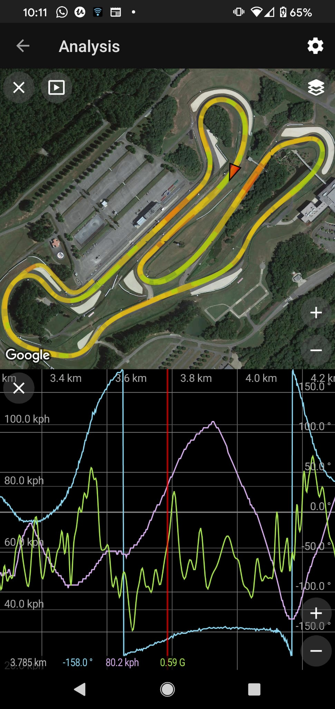
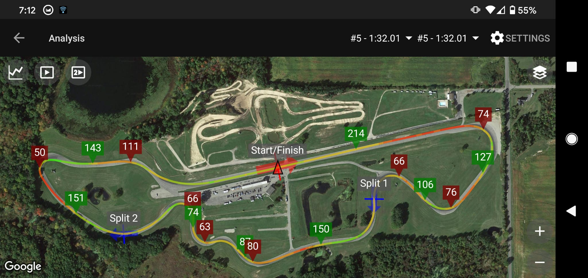

# Speedangle to Racechrono
## Speedangle .sa to racechrono .vbo converter

This script lets you use a .sa file as exported from a Speedangle apex lap timer using the R4 software and convert it into a .vbo file that racechrono accepts natively.

There are no dependencies for this script except there needs to be python3 installed. I made sure to use the inbuilt math library instead of numpy to facilitate this as well.

If you run into any issues using this script please report the problem so I can try to address it. 

## Usage

You can convert files online at https://sa2rc.herokuapp.com/ if you don't want to run it locally. It is rudimentary looking but does the conversion the same.

To run it locally...

```
python3 speedangle_2_racechrono.py -i ~/Downloads/BARBER\ 110820\ 140040.sa -o barber.vbo
```
* After the conversion, send the .vbo file to the phone/tablet device using whatever medium works for you (email, gdrive etc.)
* In racechrono, click import from the three dot menu in top right, select data type as RaceHF/VBOX Sport, click file browser and point to the newly uploaded vbo file.
* Click Start

If successfully imported you should have the session available in the UI.

```
$ python3 speedangle_2_racechrono.py
usage: speedangle_2_racechrono.py [-h] [-i IN_FILE] [-o OUT_FILE] [-a] [-V]

optional arguments:
  -h, --help            show this help message and exit
  -i IN_FILE, --in_file IN_FILE
                        Required - .sa input filename
  -o OUT_FILE, --out_file OUT_FILE
                        .vbo output filename
  -a, --analyze         Analyze only
  -V, --version         script version
```

There's a bit of new functionality where the script analyzes the data and provides lap level info, e.g.

```
$ python3 speedangle_2_racechrono.py -i "test_data/PHILLIP ISLAND 060114 154831 Custom Field 2.sa" -a
INFO:2021-06-04 04:38:02,233 Read speedangle source file test_data/PHILLIP ISLAND 060114 154831 Custom Field 2.sa
INFO:2021-06-04 04:38:02,704 Format conversion complete
INFO:2021-06-04 04:38:02,704 Analyzing lap data

Lap	Start   		End   		  Lap_Time	Sector_Times
1	  15:49:01.0	15:51:54.0	02:53.0		33.1  63.6  146.0  
2	  15:51:54.0	15:53:43.2	01:49.2		29.8  58.0  85.5  
3	  15:53:43.2	15:55:32.3	01:49.1		29.8  57.8  85.1  
4	  15:55:32.3	15:57:19.9	01:47.6		29.4  57.1  84.2  
5	  15:57:19.9	15:59:09.9	01:50.0		30.0  57.6  85.9  
6	  15:59:09.9	16:00:57.9	01:48.0		29.4  57.1  84.3  
7	  16:00:57.9	16:02:49.6	01:51.7		28.5  56.0  83.2  
```

## Screenshots 




